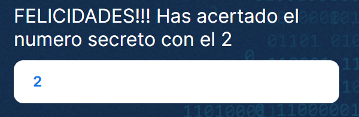

# **Juego del numero secreto**

## *Instrucciones:*

* Al **INICIALIZAR** el juego se solicitara al jugador un rango con el que desea jugar la partida:

    

    en este ***ejemplo*** estamos ingresando en numero **10** por lo tanto el el numero aleatorio se generara  del **1** al **10**.

* El jugador tendrá 3 chances de acertar el numero secreto que ya están pre-establecidos en el código, si quisieras cambiar la cantidad de intentos puedes editar los intentos en la siguiente variable.

  * ```js
    let intentos = 3;
    ```  

* Al **INICIAR** el juego y acertar el numero secreto, aparecerá un mensaje indicando que has acertado lo cual hará que se desactive el botón de **INTENTO** y se active **NUEVO JUEGO** para asi iniciar una nueva partida.
  
    

* Al **FALLAR** los todos los intentos aparecerá un mensaje y deberás **reiniciar** el juego con el mismo método anterior ya que los botones se habitaran y deshabilitaran como es correspondiente
  
  

---
---

## Explicación de código para desarrolladores:


